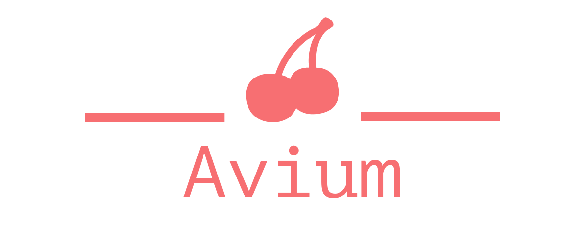

<div style="text-align: center;">


[](https://coveralls.io/github/VasilisMylonas/avium?branch=feature/coveralls-support)

</div>

# Avium

An object-oriented C utility library.

## Description

Avium is a library that aims to fill in many missing features in the C language while remaining simple and understandable. If you are looking for an intuitive and object-oriented utility library, then Avium might be for you.

## Key Features

- Resizable, heap allocated strings.
- Program argument parsing and help prompts.
- Runtime type information.
- Class and interface types, inheritance and virtual functions.
- Generic result and optional types.
- Fixed size generic arrays.
- Testing utilities.
- Intuitive formatted IO.
- Garbage collecting (with support for libgc).

And many more!

## Prerequisites

- A C11-compatible compiler such as Clang or GCC and MSVC for Windows.
- [CMake](https://cmake.org/) version 3.5.0 or newer.
- [Python 3](https://www.python.org/) with pip.
- A Bash-compatible shell or Powershell on Windows.

For building the documentation, the following dependencies are also needed:

- Doxygen
- sphinx
- breathe
- sphinx-rtd-theme

## Building

### Unix-like

Run the build script. Change 'Release' to 'Debug' for a debug build.

``` bash
# Clone this repository
$ git clone https://github.com/VasilisMylonas/avium.git

# Go into the repository
$ cd avium

# Build
$ ./scripts/build.sh ./build Release

# Run the tests
$ ./scripts/test.sh ./build Release
```

If on Windows, run the scripts with the .ps1 extension instead.

## Supported Platforms

Currently the following configurations are supported:

| Architecture | Operating System | Compiler |
| ------------ | ---------------- | -------- |
| x86_64       | Ubuntu           | GCC      |
| x86_64       | Ubuntu           | Clang    |
| x86_64       | Windows          | MSVC     |
| x86_64       | MacOS            | GCC      |

## Contributing

If you are interested in contributing, please take the time to read [CONTRIBUTING.md](./CONTRIBUTING.md).

## Contact Us

You may join us on [our Discord server](https://discord.gg/ntcjbMbVts). For more information about the project, questions etc. you can ask there!

## License

Avium is licensed under version 3 of the GNU Lesser General Public License. See [COPYING](./COPYING) and [COPYING.LESSER](./COPYING.LESSER) for more information.
