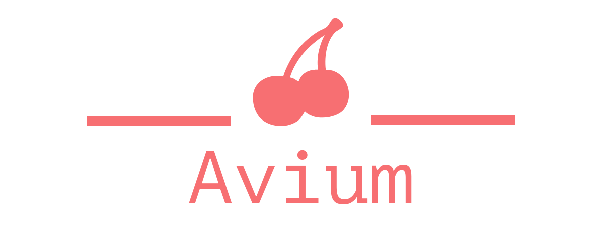

    

# Avium

An object oriented C utility runtime.

## Description

Avium is a library that aims to fill in many missing features in the C language while remaining simple and understandable. If you are looking for an intuitive and object oriented utility library, then Avium might be for you.

## Note

The API is currently not stable and will be subject to change.

## Authors

-   Vasilis Mylonas

_Feel free to expand this list._

## License

Avium is licensed under version 3 of the GNU Lesser General Public License. See [COPYING](./COPYING) and [COPYING.LESSER](./COPYING.LESSER) for more information.
